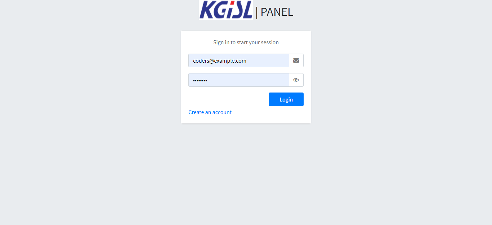
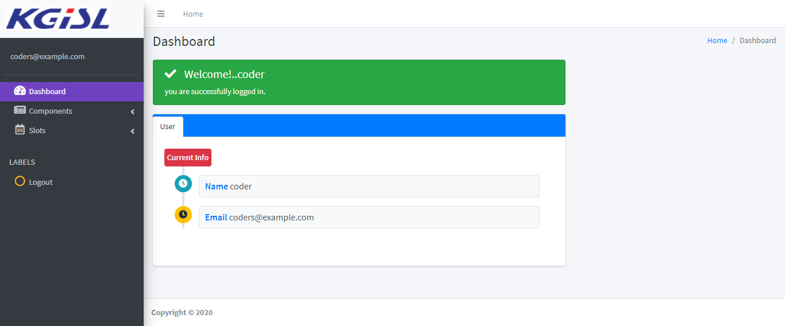
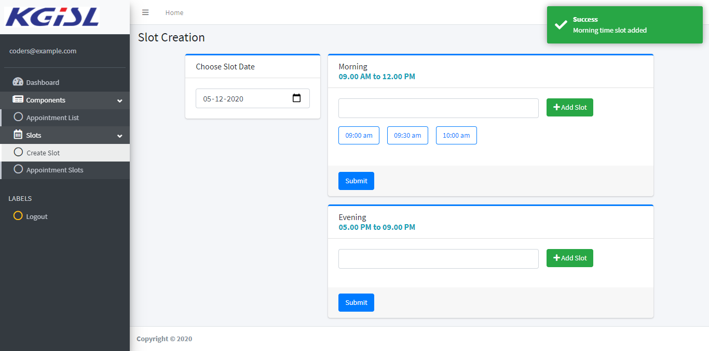
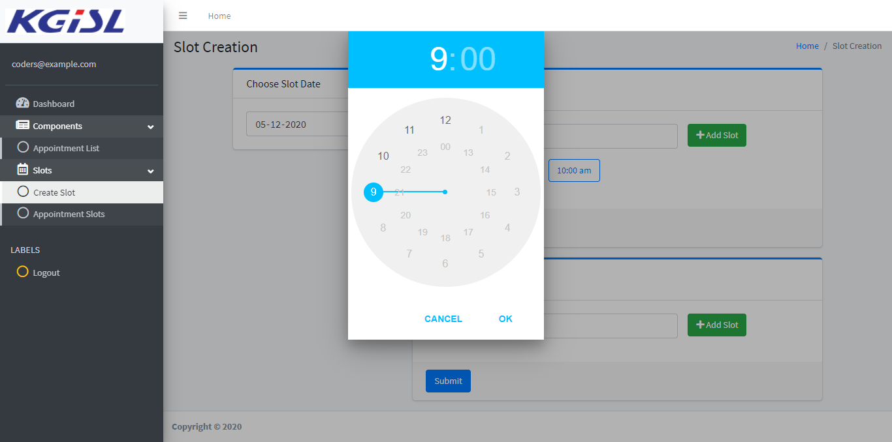
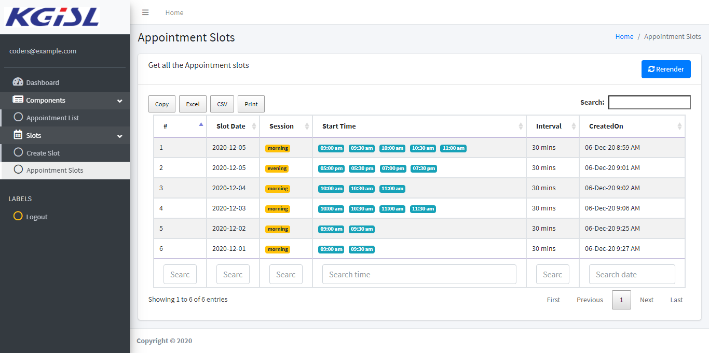
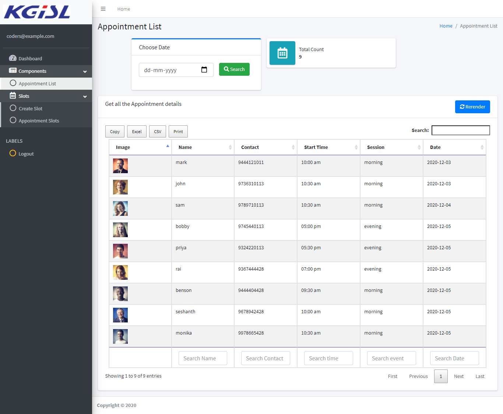
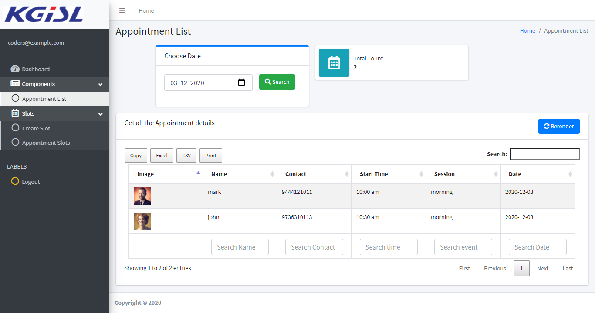

# APPOINTMENTAPP

## Description
APPOINTMENTAPP is an appointment manager. Users can book appointements on predefined time slots. These slots are defined by the doctor. Doctor can see the list of appointments on a specific day and the total number of appointments. 

Mongo Atlas is used to save the slots and appointment details.

## Prerequisites
1. Nodejs v12
2. Angular 9

## Tech Stack
1. Angular 9
2. NodeJs  v12
3. Mongo db

## Steps - api
1. git clone https://gitlab.com/thiyagu.pp/appointmentapp
2. cd appointmentapp/api
3. `npm i ` to install the dependencies.
4. `npm run dev` to run the apis

## Steps - Frontend
1. cd appointmentapp/angular
2. `npm i` to install dependencies
3. To run it in development mode use, `npm start`.

## Screenshots

### login

### register

### dashboard

### slot create

### slot create set time

### slot list

### appintmentList

### date-filter

